# Art by Lucas Suarez

Welcome, I am a self taught Seattle based artist. I created a variety of pieces using water colors, ink, pen, pencil, color pencil and arylics.
I'm always trying new mediums and pushing the limits of traditonal art. 

See bi-weekly updates on my instagram: https://www.instagram.com/lusucasarez/

****

Forks of Fate - TTRPG Concept Pitch

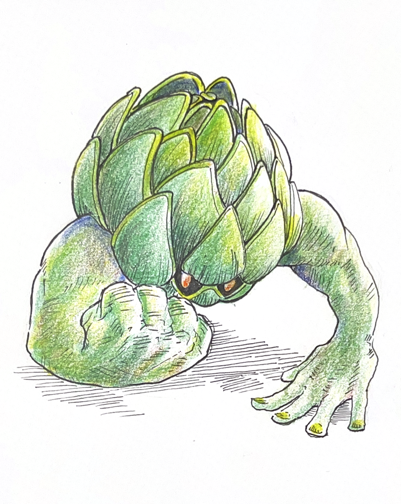 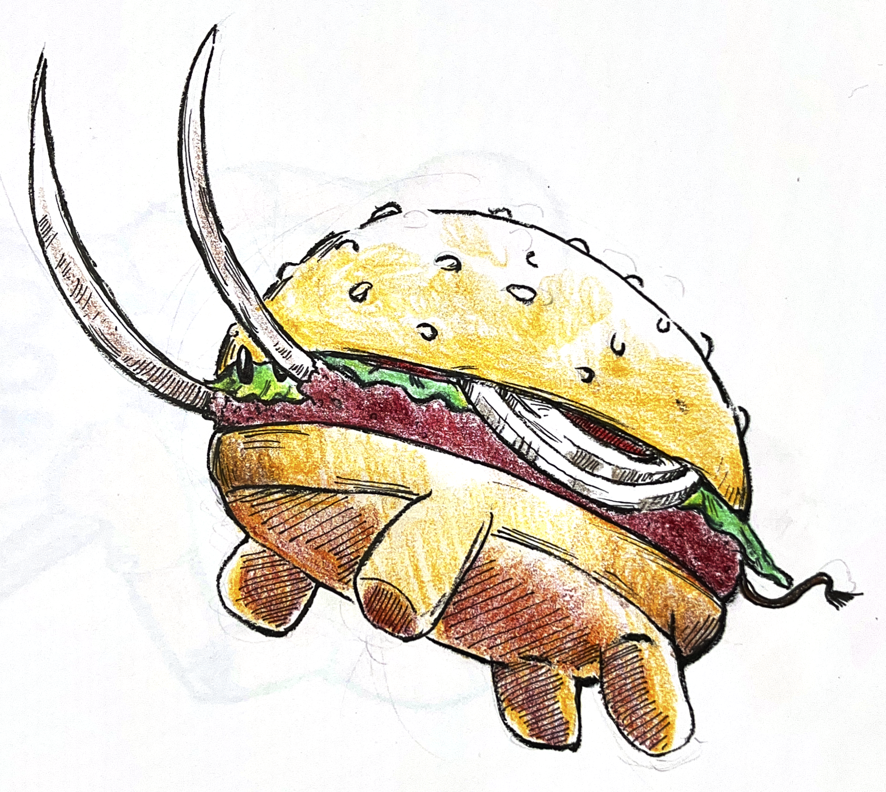 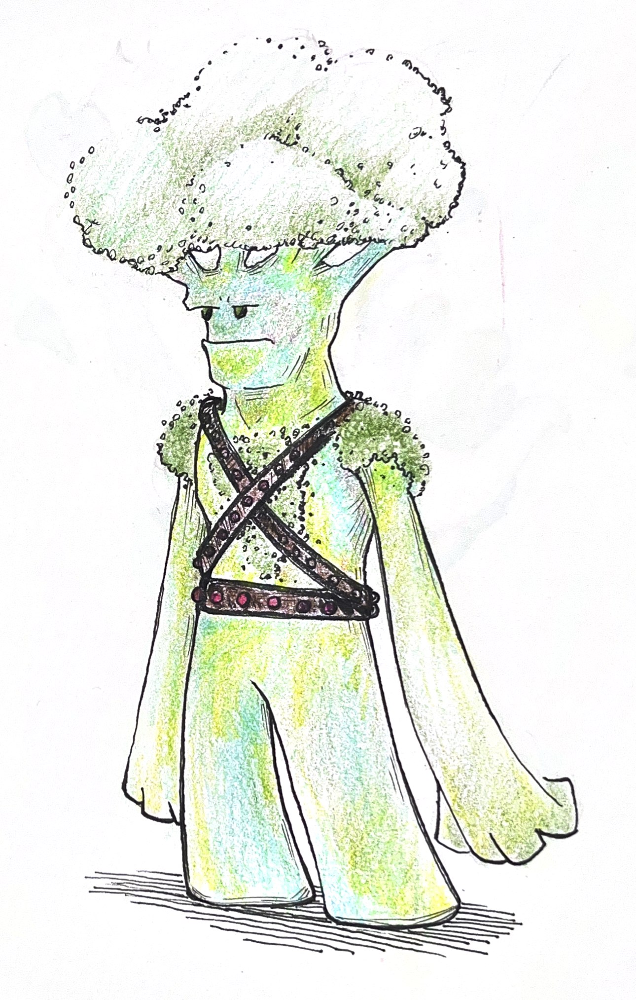 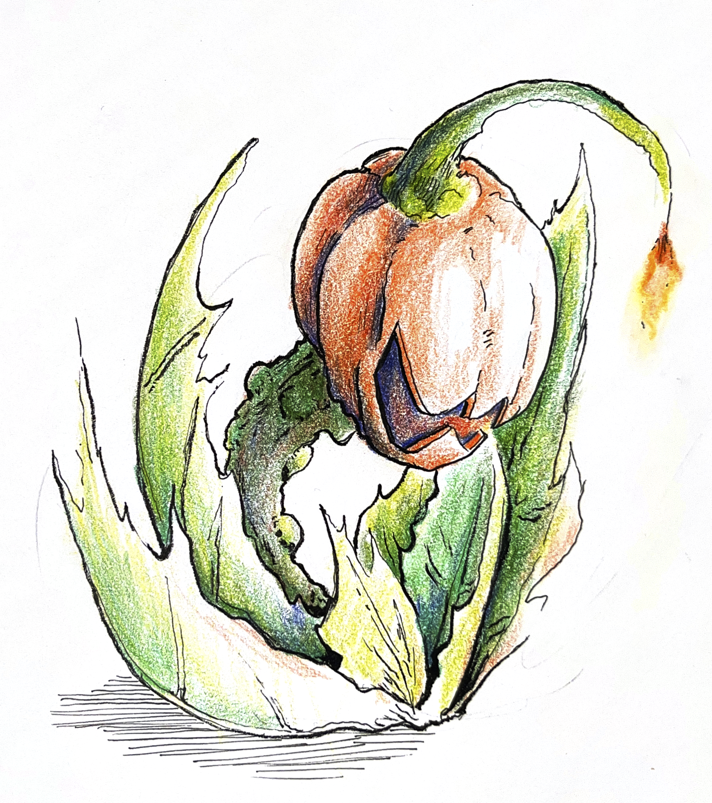   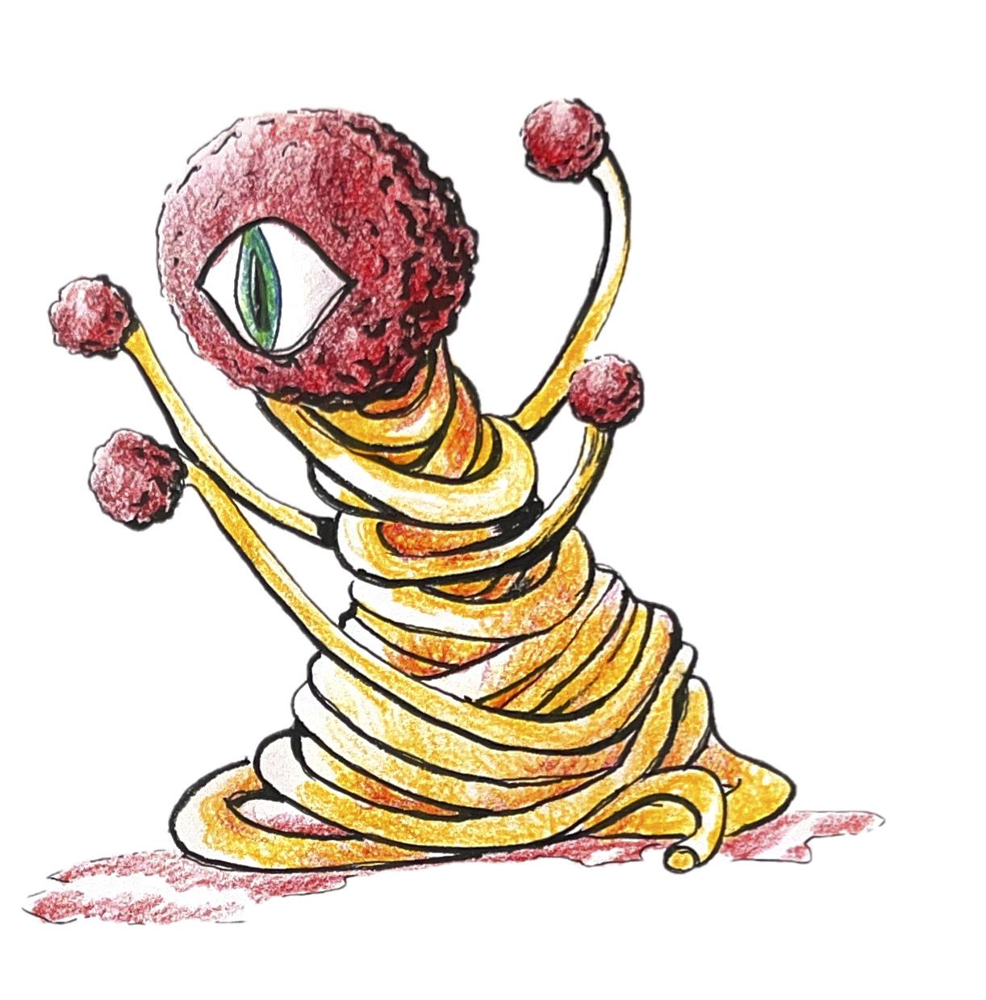

****

Stary Signals - Video Game prototype

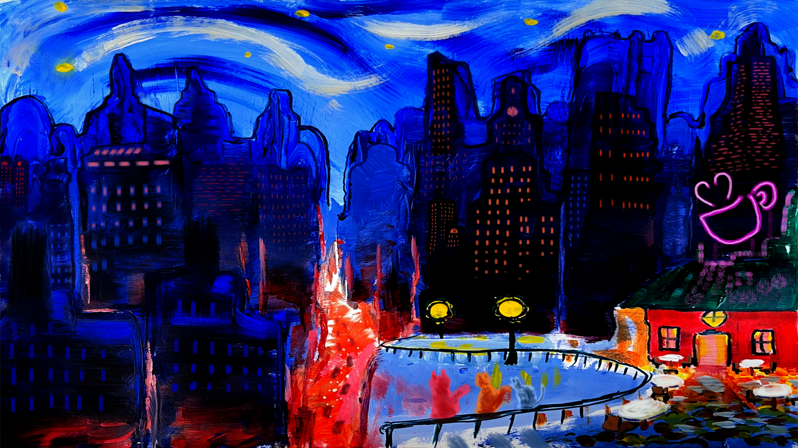
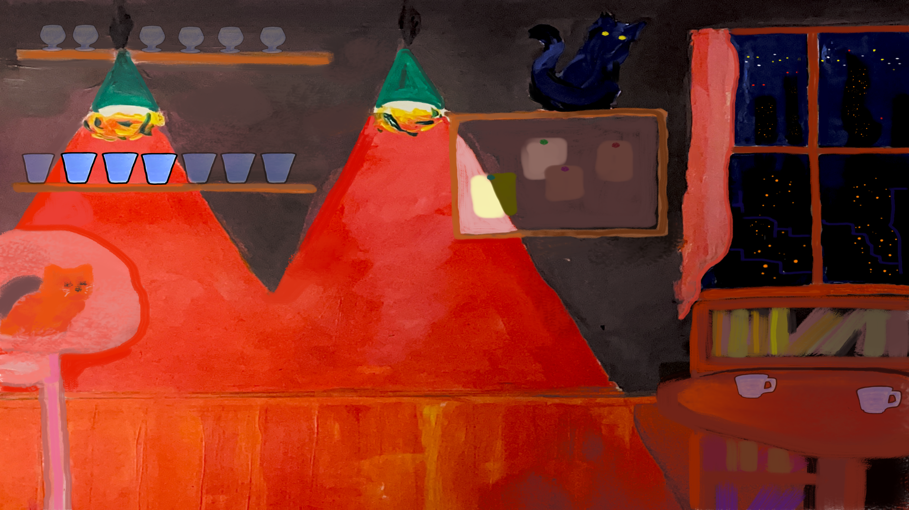 

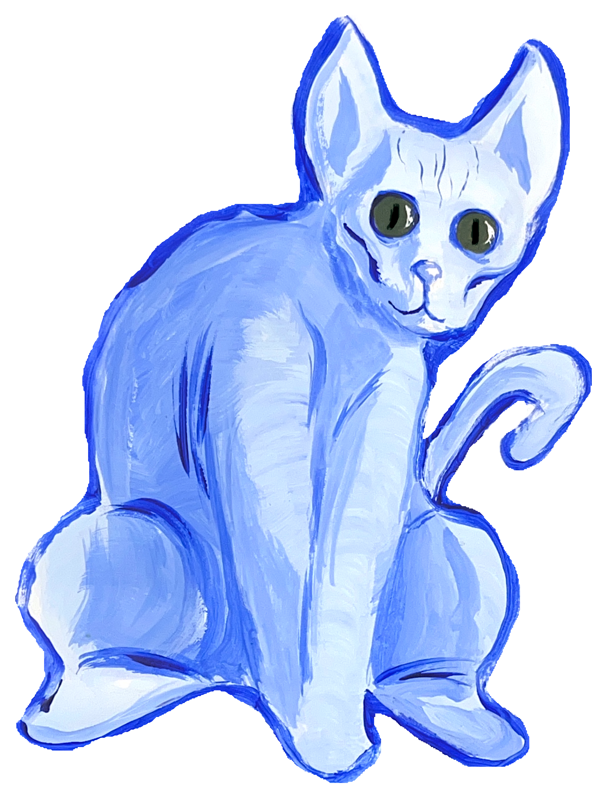 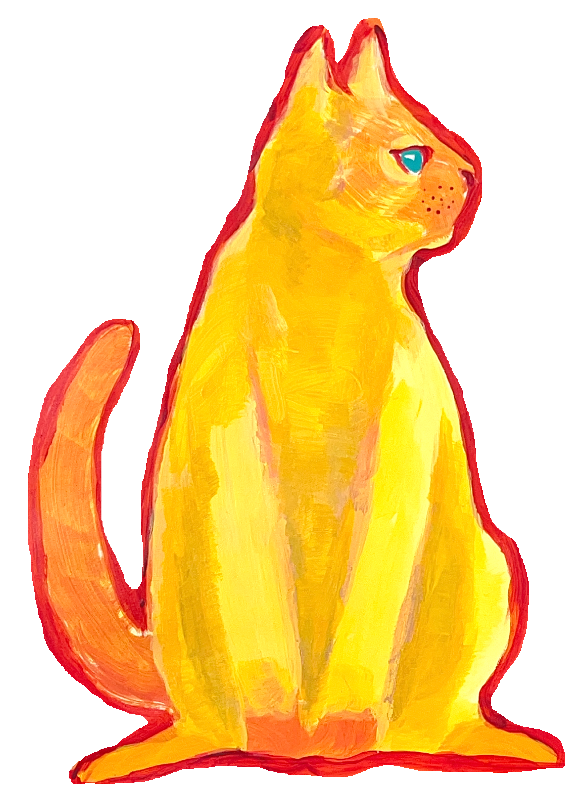 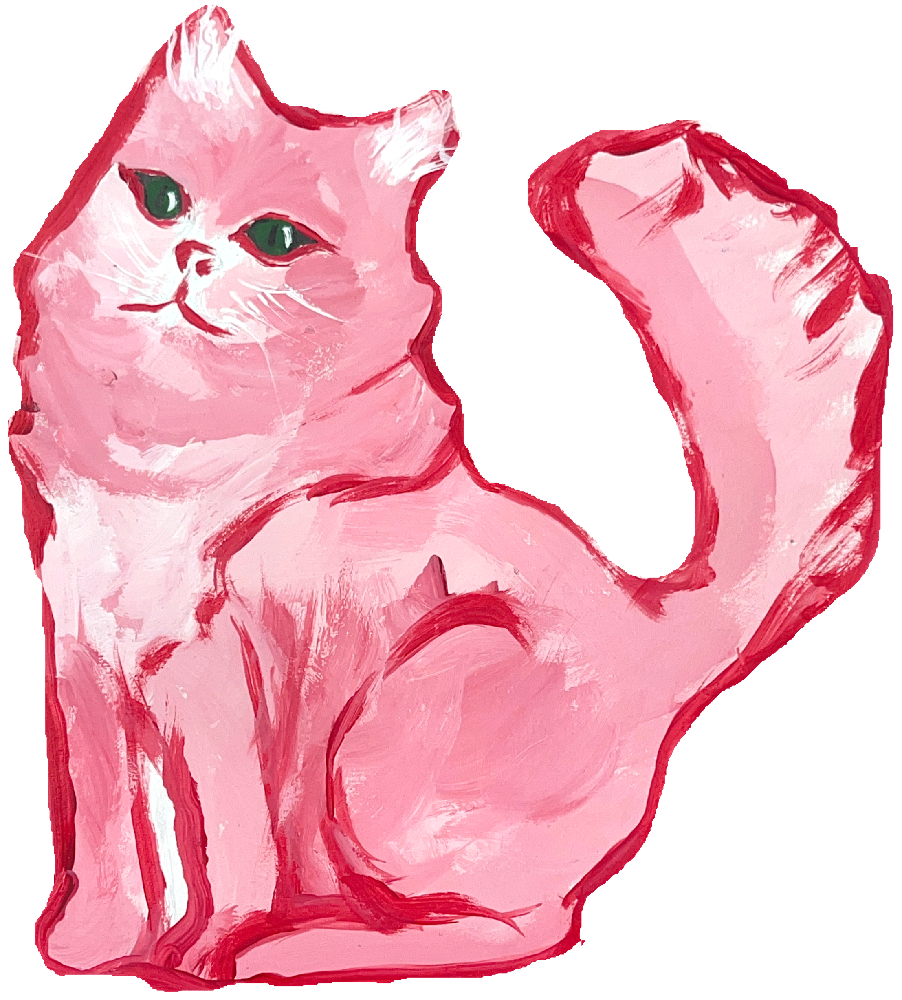
****

Personal Works

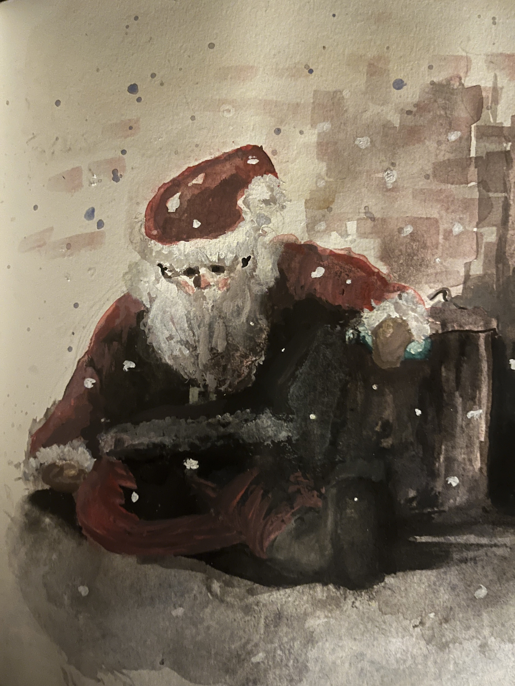 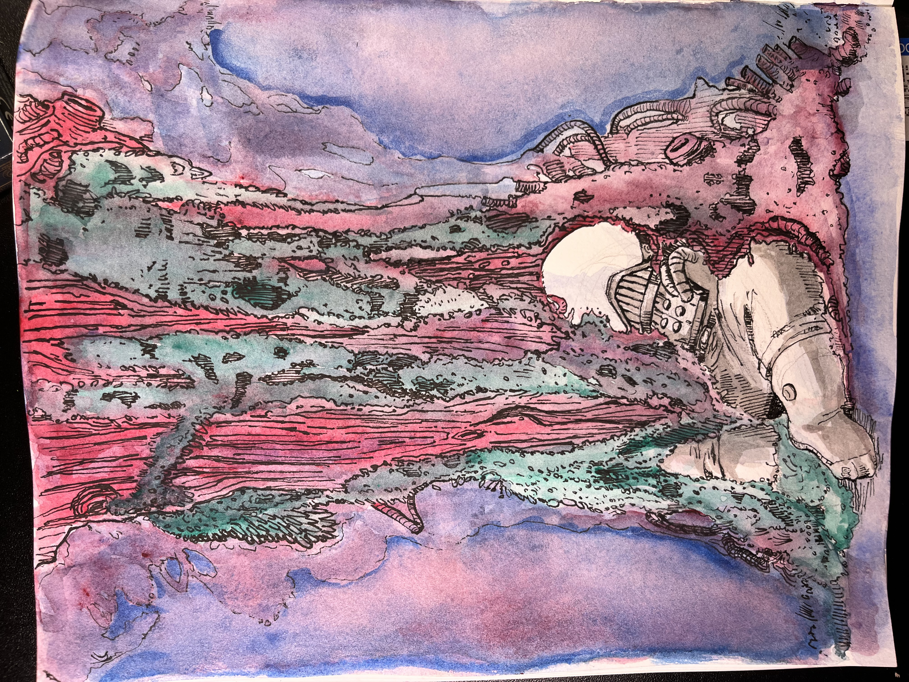 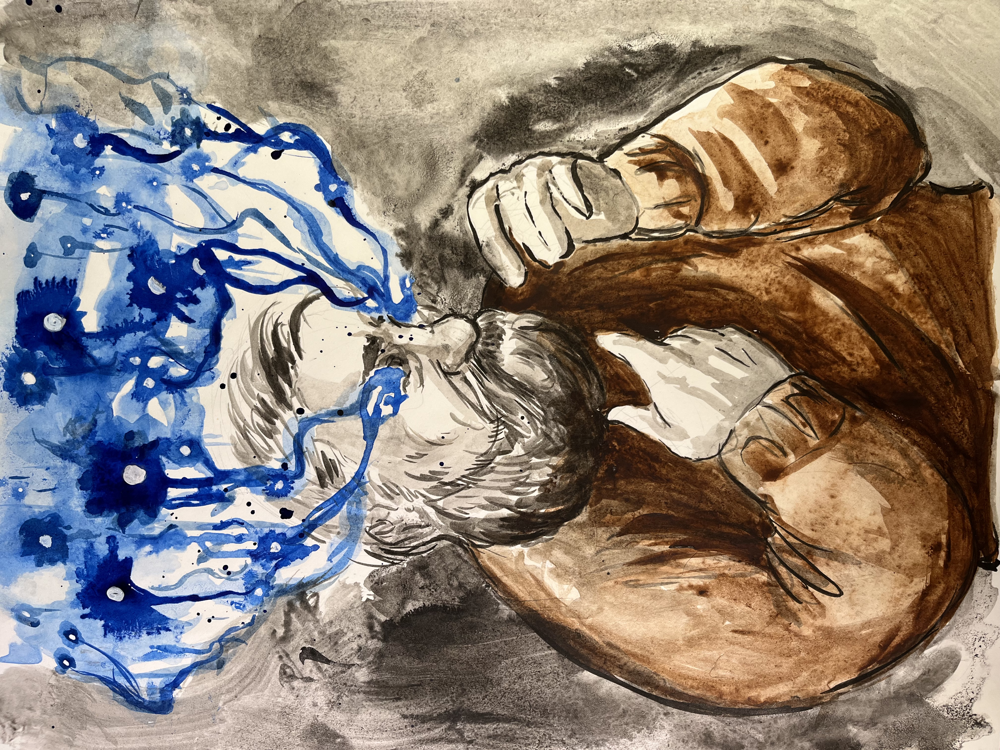 

